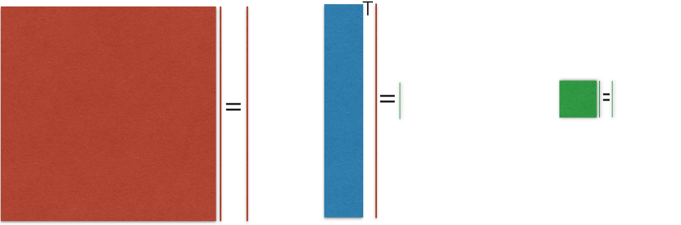

# LearnROM

Learn Reduced Order Models in high-dimensional spaces.

Model reduction is known very challenging for high-dimensional parametric problems whose solutions also live in high-dimensional manifolds. However, often the manifold of some quantity of interest (QoI) depending on the parametric solutions is low-dimensional. LearnROM implements structure-exploiting algorithms to efficiently learn the intrinsic parameter subspace in which the QoI is most sensitive. Both the gradient-based active subspace and Hessian-based subspace are implemented in LearnROM. Samples are drawn from such subspaces to learn the QoI-oriented ROM. 

  
  

